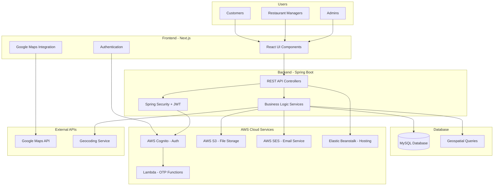

# 🍽️ AtlasReserve - Restaurant Reservation Platform

A comprehensive full-stack restaurant reservation system built with modern technologies, enabling customers to discover and book restaurants while providing management tools for restaurant owners and administrators.

## 🌟 Project Overview

AtlasReserve is a complete restaurant reservation platform that connects diners with restaurants through an intuitive booking system. The platform supports multiple user roles and provides real-time availability, location-based search, and comprehensive management features.

### Key Features
- **Customer Portal**: Search restaurants, make reservations, view bookings, leave reviews
- **Restaurant Manager Portal**: Manage restaurant details, view bookings, upload photos, handle operations
- **Admin Portal**: Approve restaurants, platform analytics, user management
- **Real-time Booking**: Conflict detection and automated email confirmations
- **Location-based Search**: Google Maps integration with geospatial queries
- **Secure Authentication**: AWS Cognito with OTP verification and role-based access

## 🏗️ System Architecture



## 🛠️ Technology Stack

### Frontend
- **Next.js 15.2.0** - React framework with SSR
- **React 19.0.0** - UI library
- **Material-UI 7.0.1** - Component library
- **SASS/SCSS** - Styling
- **Axios** - HTTP client

### Backend
- **Spring Boot 3.4.3** - Java framework
- **Java 17** - Programming language
- **Spring Security** - Authentication & authorization
- **Spring Data JPA** - Database access
- **MySQL 8.0** - Primary database
- **Gradle** - Build tool

### Cloud & DevOps
- **AWS Cognito** - User authentication
- **AWS S3** - File storage
- **AWS SES** - Email service
- **AWS Elastic Beanstalk** - Application hosting
- **AWS Lambda** - Serverless functions
- **Docker** - Containerization
- **GitHub Actions** - CI/CD pipeline

### External Services
- **Google Maps API** - Location services
- **Google Places API** - Place search and details

## 🚀 Getting Started

### Prerequisites
- **Node.js** (v18.x or v20.x)
- **Java 17** (JDK)
- **MySQL 8.0**
- **Docker** (optional)
- **AWS Account** (for cloud services)

### Environment Setup

#### Backend Configuration
Create `backend/bookTable/src/main/resources/application-local.properties`:

```properties
# Database
spring.datasource.url=jdbc:mysql://localhost:3306/atlasreserve
spring.datasource.username=your_db_username
spring.datasource.password=your_db_password

# AWS Configuration
aws.accessKeyId=your_aws_access_key
aws.secretKey=your_aws_secret_key
aws.region=us-west-2

# AWS Cognito
spring.security.oauth2.resourceserver.jwt.issuer-uri=https://cognito-idp.us-west-2.amazonaws.com/your_user_pool_id
cognito.userPoolId=your_user_pool_id
cognito.clientId=your_client_id
cognito.clientSecret=your_client_secret

# AWS S3
aws.s3.bucket=your_s3_bucket_name

# Google Maps
google.api.key=your_google_maps_api_key

# Email
aws.ses.from-email=noreply@yourapp.com
```

#### Frontend Configuration
Create `open-table-frontend/.env.local`:

```bash
NEXT_PUBLIC_BASE_URL=http://localhost:8080
NEXT_PUBLIC_PLACES_API_KEY=your_google_places_api_key
NEXT_PUBLIC_GOOGLE_MAPS_API_KEY=your_google_maps_api_key
```

### Installation & Running

#### Using Docker (Recommended)
```bash
# Clone the repository
git clone https://github.com/Mrnidhi/AtlasReserve.git
cd AtlasReserve

# Start all services
docker-compose up -d

# Access the application
# Frontend: http://localhost:3000
# Backend API: http://localhost:8080
```

#### Manual Setup

**Backend:**
```bash
cd backend/bookTable
chmod +x ./gradlew
./gradlew clean build
./gradlew bootRun
```

**Frontend:**
```bash
cd open-table-frontend
npm install
npm run dev
```

**Database:**
```sql
CREATE DATABASE atlasreserve CHARACTER SET utf8mb4 COLLATE utf8mb4_unicode_ci;
```

### Verification
```bash
# Check backend health
curl http://localhost:8080/actuator/health

# Check frontend
curl http://localhost:3000
```

## 📱 Core Functionality

### For Customers
1. **Search Restaurants** - Find restaurants by location, cuisine, or name
2. **View Details** - Restaurant info, photos, reviews, and availability
3. **Make Reservations** - Book tables with real-time conflict detection
4. **Manage Bookings** - View, modify, or cancel reservations
5. **Leave Reviews** - Rate and review dining experiences

### For Restaurant Managers
1. **Restaurant Management** - Add/update restaurant details and photos
2. **Booking Management** - View and manage incoming reservations
3. **Operations** - Set hours, manage tables, and time slots
4. **Analytics** - View booking trends and customer feedback

### For Administrators
1. **Restaurant Approval** - Approve/reject new restaurant registrations
2. **Platform Management** - Oversee all restaurants and users
3. **Analytics Dashboard** - Platform-wide statistics and insights
4. **Content Moderation** - Manage reviews and user content

## 🔐 Security Features

- **Multi-Factor Authentication** with OTP verification
- **Role-Based Access Control** (Customer, Manager, Admin)
- **JWT Token Authentication** with secure HTTP-only cookies
- **Input Validation** and SQL injection prevention
- **CORS Configuration** for secure cross-origin requests
- **AWS IAM Roles** for secure cloud service access

## 📊 Database Design

The system uses MySQL with the following key entities:
- **Users** - Customer and staff accounts
- **Restaurants** - Restaurant information and settings
- **Bookings** - Reservation records with conflict detection
- **Reviews** - Customer feedback and ratings
- **Tables & Time Slots** - Restaurant capacity management
- **Photos** - Restaurant image management

## 🚀 Deployment

The application is deployed on AWS using:
- **Elastic Beanstalk** for application hosting
- **RDS MySQL** for database
- **S3** for file storage
- **CloudFront** for CDN
- **Route 53** for DNS management

## 🤝 Contributing

1. Fork the repository
2. Create a feature branch (`git checkout -b feature/amazing-feature`)
3. Commit changes (`git commit -m 'Add amazing feature'`)
4. Push to the branch (`git push origin feature/amazing-feature`)
5. Open a Pull Request

## 📞 Support

- **Issues**: [GitHub Issues](https://github.com/Mrnidhi/AtlasReserve/issues)
- **Documentation**: [Project Wiki](https://github.com/Mrnidhi/AtlasReserve/wiki)

## 📄 License

This project is licensed under the MIT License - see the [LICENSE](LICENSE) file for details.

---

<div align="center">

**Built with ❤️ for seamless dining experiences**

[⭐ Star this repository](https://github.com/Mrnidhi/AtlasReserve) | [🐛 Report Bug](https://github.com/Mrnidhi/AtlasReserve/issues) | [💡 Request Feature](https://github.com/Mrnidhi/AtlasReserve/issues)

</div>