# 🍽️ AtlasReserve - Restaurant Reservation Platform

[](https://www.oracle.com/java/)
[](https://spring.io/projects/spring-boot)
[](https://nextjs.org/)
[](https://reactjs.org/)
[](https://aws.amazon.com/)
[](https://www.docker.com/)

## 📋 Table of Contents
- [🌟 Project Overview](#-project-overview)
- [✨ Key Features](#-key-features)
- [🏗️ System Architecture](#️-system-architecture)
- [🚀 Technology Stack](#-technology-stack)
- [📐 Database Design](#-database-design)
- [🔐 Security & Authentication](#-security--authentication)
- [☁️ Cloud Infrastructure](#️-cloud-infrastructure)
- [🛠️ Installation & Setup](#️-installation--setup)
- [🚀 Deployment](#-deployment)
- [📱 API Documentation](#-api-documentation)
- [🧪 Testing](#-testing)
- [📈 Performance & Monitoring](#-performance--monitoring)
- [🤝 Contributing](#-contributing)
- [📄 License](#-license)

## 🌟 Project Overview

**AtlasReserve** is a comprehensive, full-stack restaurant reservation platform designed to revolutionize the dining experience. Built with modern technologies and cloud-native architecture, it provides seamless booking experiences for customers, efficient management tools for restaurant owners, and powerful administrative capabilities.

### 🎯 Purpose
To create an intuitive, scalable, and reliable platform that connects diners with restaurants while providing robust management tools for all stakeholders in the restaurant ecosystem.

## ✨ Key Features

### 👥 Multi-Role User Management
- **Customers**: Browse, book, and manage reservations
- **Restaurant Managers**: Manage restaurant details, view bookings, and analytics
- **Administrators**: Oversee platform operations and restaurant approvals

### 🔍 Advanced Restaurant Discovery
- **Location-based Search**: Find restaurants using geospatial queries
- **Interactive Maps**: Google Maps integration for location visualization
- **Smart Filters**: Filter by cuisine, ratings, availability, and distance
- **Real-time Availability**: Live table availability checking

### 📅 Intelligent Booking System
- **Real-time Conflict Detection**: Prevents double bookings
- **Email Confirmations**: Automated confirmation and reminder emails
- **Flexible Cancellation**: Easy booking modifications and cancellations
- **Time Slot Management**: Dynamic time slot generation based on restaurant capacity

### ⭐ Review & Rating System
- **Authenticated Reviews**: Verified customer reviews and ratings
- **Aggregate Scores**: Comprehensive rating analytics
- **Review Moderation**: Admin-controlled review management

### 🖼️ Media Management
- **Secure Image Uploads**: AWS S3 integration with pre-signed URLs
- **Image Optimization**: Automatic image processing and optimization
- **CDN Distribution**: Fast image delivery via CloudFront

## 🏗️ System Architecture

### High-Level Architecture Diagram

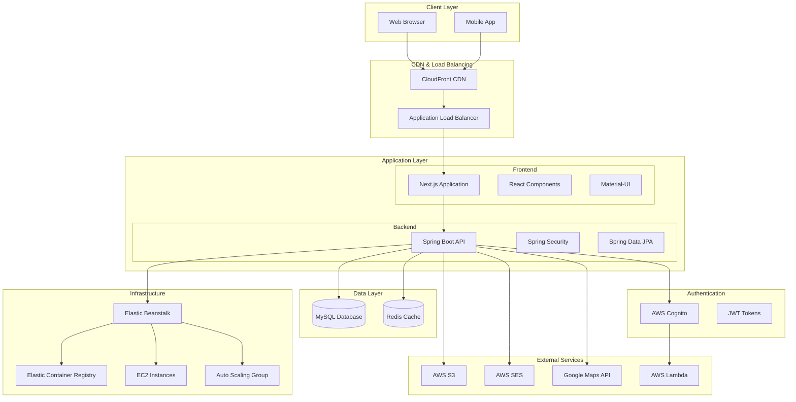

### Microservices Architecture

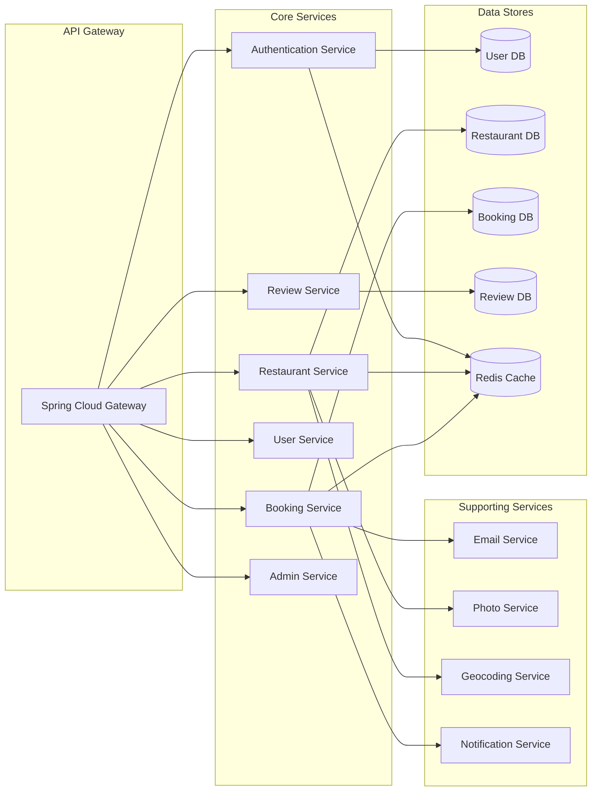

### Data Flow Architecture

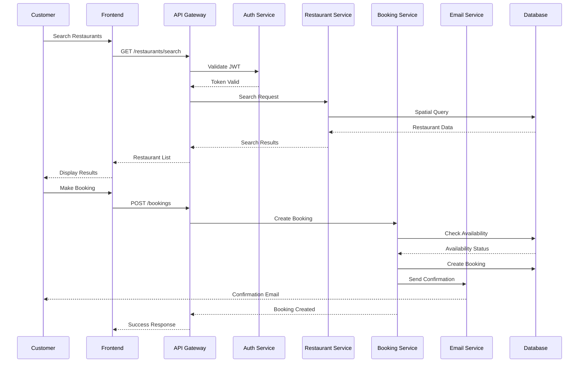

## 🚀 Technology Stack

### Frontend Stack
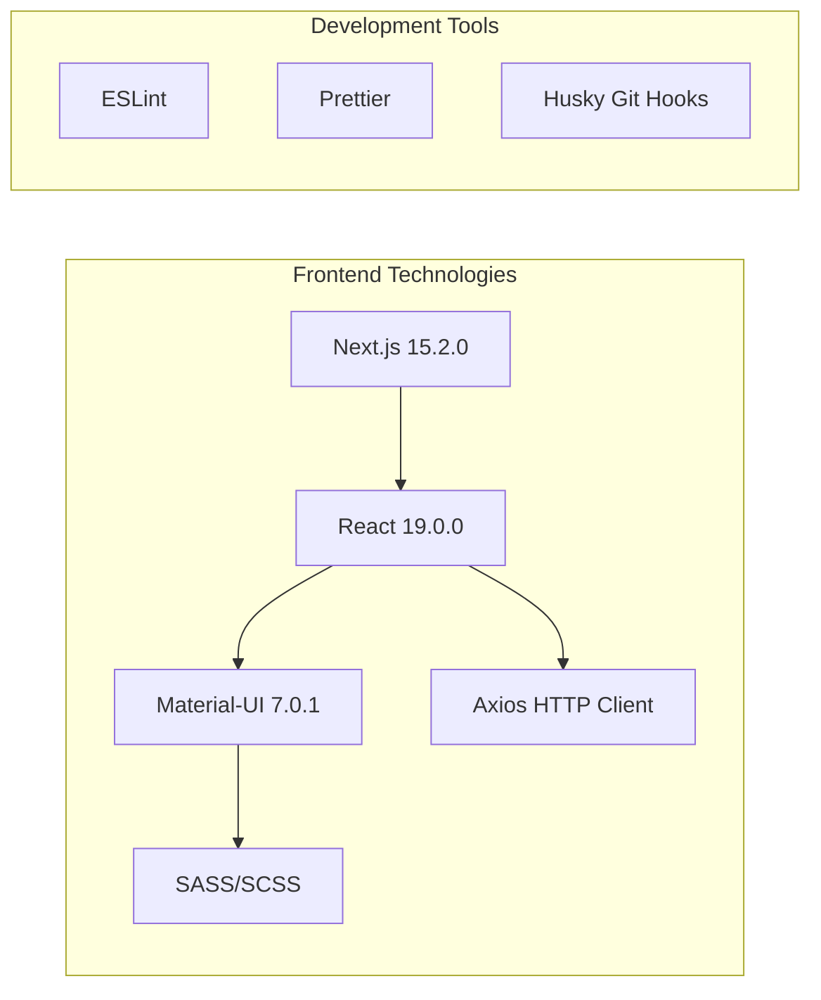

### Backend Stack
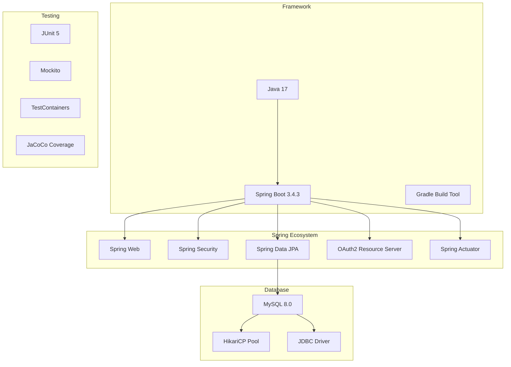

### Cloud & DevOps
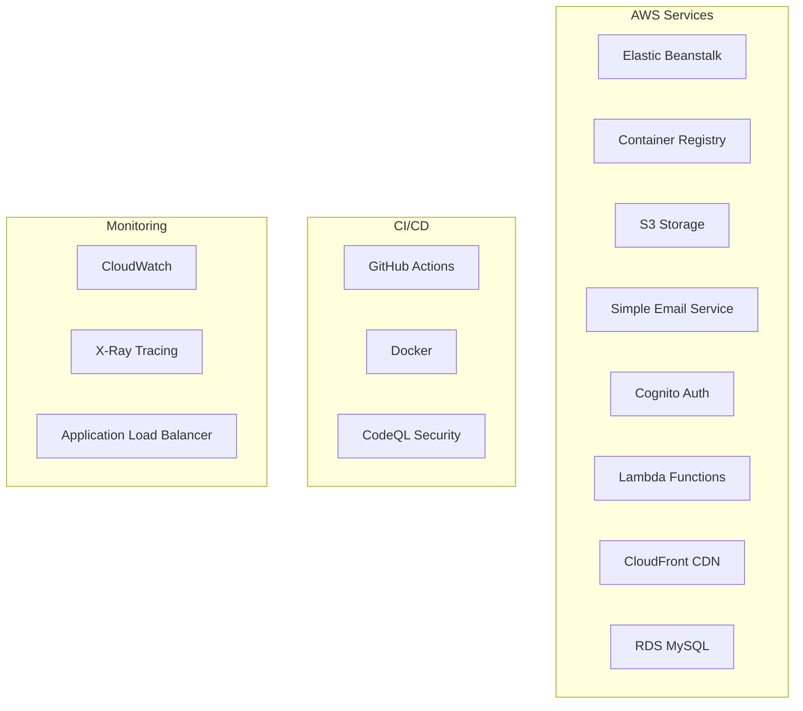

## 📐 Database Design

### Entity Relationship Diagram

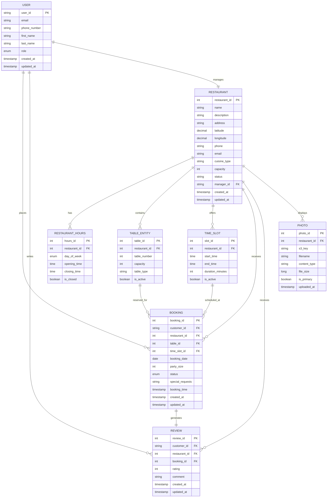

## 🔐 Security & Authentication

### Authentication Flow

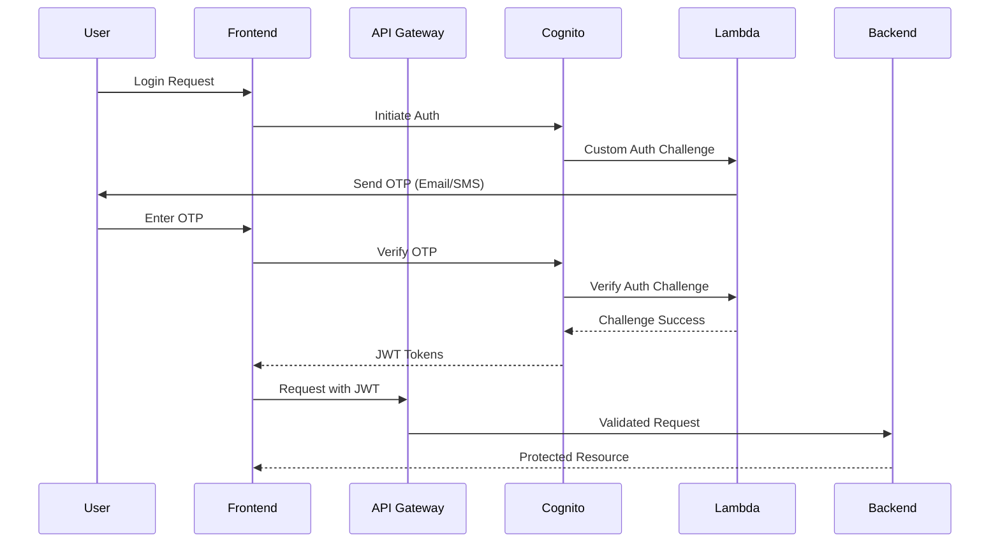

### Authorization Matrix

| Role | Restaurant Management | Booking Management | User Management | Admin Functions |
|------|----------------------|-------------------|----------------|----------------|
| **Customer** | ❌ View Only | ✅ Own Bookings | ✅ Own Profile | ❌ |
| **Restaurant Manager** | ✅ Own Restaurant | ✅ Restaurant Bookings | ✅ Own Profile | ❌ |
| **Admin** | ✅ All Restaurants | ✅ All Bookings | ✅ All Users | ✅ Platform |

## ☁️ Cloud Infrastructure

### AWS Architecture Diagram

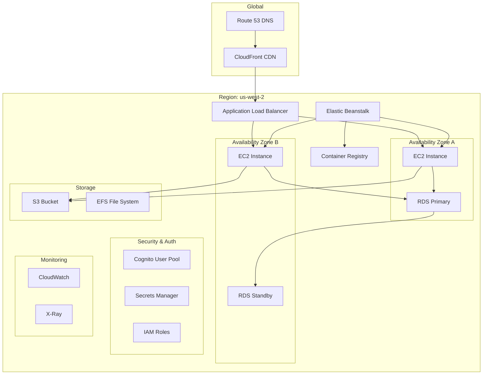

## 🛠️ Installation & Setup

### Prerequisites

- **Node.js** (v18.x or v20.x)
- **Java Development Kit** (JDK 17)
- **Docker** and **Docker Compose**
- **AWS CLI** (configured with credentials)
- **MySQL** 8.0 or compatible database

### Environment Setup

#### Backend Configuration

Create `backend/bookTable/src/main/resources/application-local.properties`:

```properties
# Database Configuration
spring.datasource.url=jdbc:mysql://localhost:3306/booktable?useSSL=false&serverTimezone=UTC
spring.datasource.username=root
spring.datasource.password=password

# AWS Configuration (use local/test values for development)
aws.accessKeyId=your-access-key
aws.secretKey=your-secret-key
aws.region=us-west-2

# AWS Cognito Configuration
spring.security.oauth2.resourceserver.jwt.issuer-uri=https://cognito-idp.us-west-2.amazonaws.com/your-user-pool-id
cognito.userPoolId=your-user-pool-id
cognito.clientId=your-client-id
cognito.clientSecret=your-client-secret

# S3 Configuration
aws.s3.bucket=your-s3-bucket-name

# Google Maps API
google.api.key=your-google-maps-api-key

# Email Configuration
aws.ses.from-email=noreply@yourapp.com
```

#### Frontend Configuration

Create `open-table-frontend/.env.local`:

```bash
NEXT_PUBLIC_BASE_URL=http://localhost:8080
NEXT_PUBLIC_PLACES_API_KEY=your-google-places-api-key
NEXT_PUBLIC_GOOGLE_MAPS_API_KEY=your-google-maps-api-key
```

### Quick Start with Docker

```bash
# Clone the repository
git clone https://github.com/Mrnidhi/AtlasReserve.git
cd AtlasReserve

# Start all services using Docker Compose
docker-compose up -d

# The application will be available at:
# Frontend: http://localhost:3000
# Backend API: http://localhost:8080
# MySQL: localhost:3306
```

### Manual Setup

#### Backend Setup

```bash
# Navigate to backend directory
cd backend/bookTable

# Make gradlew executable (Unix/Linux/MacOS)
chmod +x ./gradlew

# Build the application
./gradlew clean build

# Run tests
./gradlew test

# Start the application
./gradlew bootRun
```

#### Frontend Setup

```bash
# Navigate to frontend directory
cd open-table-frontend

# Install dependencies
npm install

# Start development server
npm run dev

# Build for production
npm run build
npm start
```

### Database Setup

```sql
-- Create database
CREATE DATABASE booktable CHARACTER SET utf8mb4 COLLATE utf8mb4_unicode_ci;

-- Create user (optional)
CREATE USER 'booktable_user'@'localhost' IDENTIFIED BY 'secure_password';
GRANT ALL PRIVILEGES ON booktable.* TO 'booktable_user'@'localhost';
FLUSH PRIVILEGES;
```

### Verification

After setup, verify the installation:

```bash
# Check backend health
curl http://localhost:8080/actuator/health

# Check frontend
curl http://localhost:3000

# Check database connection
mysql -u root -p -e "SHOW DATABASES;"
```

## 🚀 Deployment

### AWS Deployment Architecture

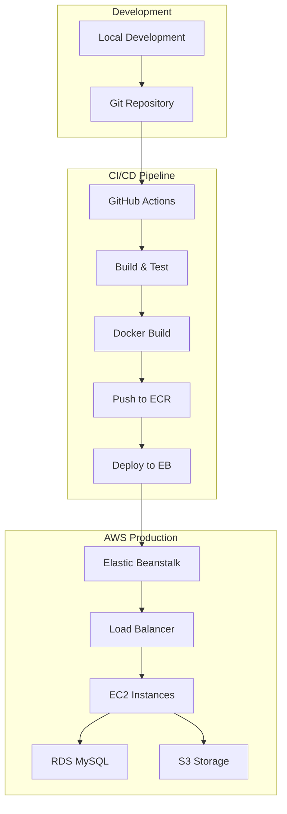

## 📱 API Documentation

### Core API Endpoints

#### Authentication Endpoints
```http
POST /api/auth/login
POST /api/auth/register
POST /api/auth/verify-otp
POST /api/auth/logout
GET  /api/auth/status
```

#### Restaurant Management
```http
GET    /api/restaurants/search?lat={lat}&lng={lng}&radius={radius}
GET    /api/restaurants/{id}
GET    /api/restaurants/{id}/availability?date={date}
POST   /api/restaurants
PUT    /api/restaurants/{id}
DELETE /api/restaurants/{id}
```

#### Booking Operations
```http
GET    /api/bookings
POST   /api/bookings
GET    /api/bookings/{id}
PUT    /api/bookings/{id}
DELETE /api/bookings/{id}
GET    /api/bookings/restaurant/{restaurantId}
```

#### Review System
```http
GET    /api/reviews/restaurant/{restaurantId}
POST   /api/reviews
PUT    /api/reviews/{id}
DELETE /api/reviews/{id}
```

### API Response Format

```json
{
  "success": true,
  "message": "Operation completed successfully",
  "data": {
    "id": 123,
    "name": "Sample Restaurant",
    "location": {
      "latitude": 37.7749,
      "longitude": -122.4194
    },
    "rating": 4.5,
    "reviews_count": 150
  },
  "metadata": {
    "page": 1,
    "limit": 20,
    "total": 500,
    "total_pages": 25
  },
  "timestamp": "2024-01-01T12:00:00Z"
}
```

## 🧪 Testing

### Testing Strategy

```mermaid
pyramid
    title Testing Pyramid
    
    section E2E Tests
      Browser Tests: 5%
      API Integration: 10%
    
    section Integration Tests
      Database Tests: 15%
      Service Tests: 20%
    
    section Unit Tests
      Component Tests: 25%
      Service Logic: 25%
```

### Test Coverage Goals

| Component | Coverage Target |
|-----------|----------------|
| Service Layer | 90%+ |
| Controller Layer | 85%+ |
| Repository Layer | 80%+ |
| React Components | 80%+ |
| Utility Functions | 95%+ |

## 📈 Performance & Monitoring

### Performance Optimization

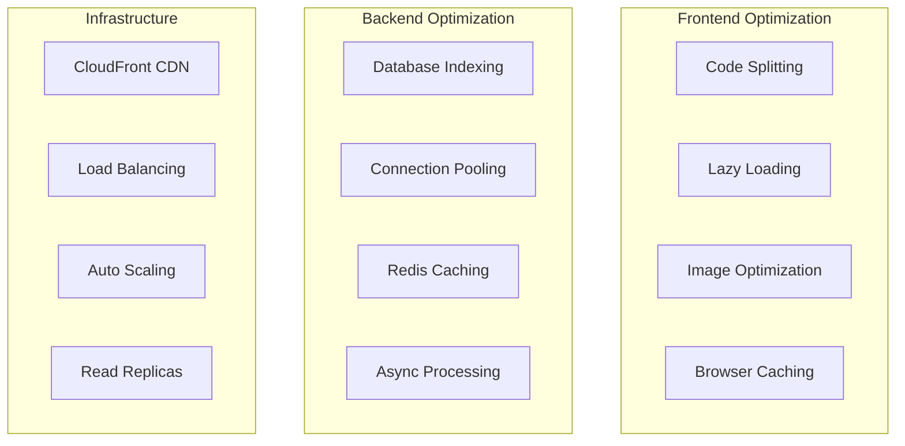

## 🤝 Contributing

### Development Workflow

1. **Fork** the repository
2. **Create** a feature branch (`git checkout -b feature/amazing-feature`)
3. **Commit** your changes (`git commit -m 'Add amazing feature'`)
4. **Push** to the branch (`git push origin feature/amazing-feature`)
5. **Open** a Pull Request

### Git Commit Convention

```
type(scope): subject

[optional body]

[optional footer]
```

Types:
- `feat`: New feature
- `fix`: Bug fix
- `docs`: Documentation changes
- `style`: Code style changes
- `refactor`: Code refactoring
- `test`: Adding tests
- `chore`: Maintenance tasks

Examples:
```
feat(booking): add real-time availability checking
fix(auth): resolve JWT token expiration issue
docs(api): update restaurant endpoint documentation
```

## 📄 License

This project is licensed under the MIT License - see the [LICENSE](LICENSE) file for details.

---

## 🚀 Quick Start Commands

```bash
# Development setup
git clone https://github.com/Mrnidhi/AtlasReserve.git
cd AtlasReserve
docker-compose up -d

# Backend only
cd backend/bookTable && ./gradlew bootRun

# Frontend only
cd open-table-frontend && npm install && npm run dev

# Run tests
./gradlew test                    # Backend tests
npm test                         # Frontend tests

# Production build
docker build -t atlasreserve .   # Build production image
```

## 📞 Support & Contact

- **Documentation**: [Project Wiki](https://github.com/Mrnidhi/AtlasReserve/wiki)
- **Issues**: [GitHub Issues](https://github.com/Mrnidhi/AtlasReserve/issues)
- **Discussions**: [GitHub Discussions](https://github.com/Mrnidhi/AtlasReserve/discussions)

---

<div align="center">

**Built with ❤️ using modern web technologies**

[⭐ Star this repository](https://github.com/Mrnidhi/AtlasReserve) | [🐛 Report Bug](https://github.com/Mrnidhi/AtlasReserve/issues) | [💡 Request Feature](https://github.com/Mrnidhi/AtlasReserve/issues)

</div>
